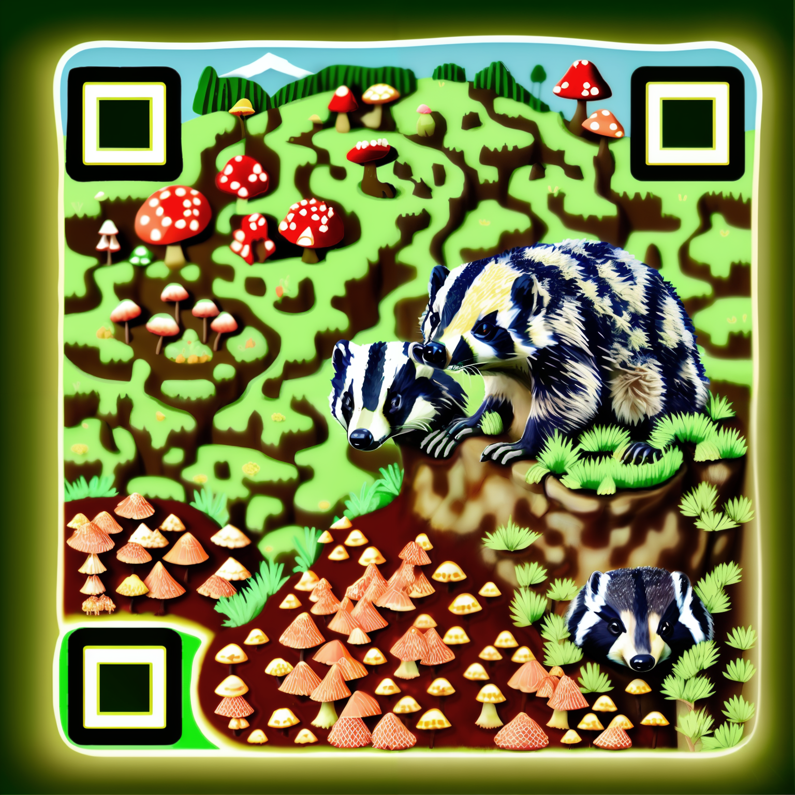

# comfy-qr

A set of ComfyUI nodes to dynamically create QR image layers for generative QR art without the hassle of leaving the webui.

Everything in this pack is for the purpose of creating patterns. If you would like to evaluate rendered patterns for scannability, check out the companion project [Comfy QR Validation Nodes](https://gitlab.com/sofuego-comfy-nodes/comfy-qr-validation-nodes). Any workflow in the example that ends with "validated" assume the installation of the validation pack as well.

This repository is managed publicly on [Gitlab](https://gitlab.com/sofuego-comfy-nodes/comfy-qr), but also mirrored on [Github](https://github.com/coreyryanhanson/comfy-qr). Please submit any [issues](https://gitlab.com/sofuego-comfy-nodes/comfy-qr/-/issues) or [pull requests](https://gitlab.com/sofuego-comfy-nodes/comfy-qr/-/merge_requests) to the gitlab repo.

## Getting started

This project currently contains two nodes for generating QR codes.

### QR Code

A dynamically sized QR code without any resampling scaled by the text length, the module size, and the error correction level.

#### Inputs

* `protocol` - If enabled this will prefix the textbox input with a preset to represent the internet protocol. This is included both for convenience and as a workaround for the textbox clipping strings with this character combination.
  * `Http` - Adds "http://" before the text.
  * `Https` - Adds "https://" before the text.
  * `None` - Uses only the contents of the `text` box.
* `text` - What text to build your QR code with. If `protocol` is specified, this textbox will be combined it with the selected option.
* `module_size` - The pixel width of the smallest unit of a QR code.
* `max_image_size` - The maximum size of the resulting QR code. If the combination of `text`, `module_size`, and `error_correction` create dimensions that exceed this, an error will halt the pipeline.
* `fill_hexcolor` - A string of characters representing the hex value of the QR units. Can be 3 or 6 hexadecimal characters with an optional # before.
* `back_hexcolor` - A string of characters representing the hex value of the space around the QR units. Can be 3 or 6 hexadecimal characters with an optional # before.
* `error_correction` - The level of error correction to apply.
  * `Low` - 7% error correction.
  * `Medium` - 15% error correction.
  * `Quartile` - 25% error correction.
  * `High` - 30% error correction.
* `border` - The border size (In multiples of `module` widths)

#### Outputs

* `IMAGE` - The QR code
* `QR_VERSION` - An integer of the QR version that was selected based on the text length and error correction level.
* `IMAGE_SIZE` - An integer based on the pixel width of the resulting QR code.

### QR Code (Conformed to Image Size)

A QR code fixed to specific output dimensions through image resampling.

#### Inputs

* `protocol` - If enabled this will prefix the textbox input with a preset to represent the internet protocol. This is included both for convenience and as a workaround for the textbox clipping strings with this character combination.
  * `Http` - Adds "http://" before the text.
  * `Https` - Adds "https://" before the text.
  * `None` - Uses only the contents of the `text` box.
* `text` - What text to build your QR code with. If `protocol` is specified, this textbox will be combined it with the selected option.
* `image_size` - The pixel dimensions to conform the QR code to.
* `fill_hexcolor` - A string of characters representing the hex value of the QR units. Can be 3 or 6 hexadecimal characters with an optional # before.
* `back_hexcolor` - A string of characters representing the hex value of the space around the QR units. Can be 3 or 6 hexadecimal characters with an optional # before.
* `error_correction` - The level of error correction to apply.
  * `Low` - 7% error correction.
  * `Medium` - 15% error correction.
  * `Quartile` - 25% error correction.
  * `High` - 30% error correction.
* `border` - The border size (In multiples of `module` widths)
* `resampling` - The resampling algorithm to use when rescaling the QR code.
  * `Bicubic` - Bicubic interpolation
  * `Bilinear` - Bilinear interpolation
  * `Box` - Box interpolation
  * `Hamming` - Hamming interpolation
  * `Lanczos` - Lanczos interpolation
  * `Nearest` - Nearest Neighbor interpolation

#### Outputs

* `IMAGE` - The QR code
* `QR_VERSION` - An integer of the QR version that was selected based on the text length and error correction level.

### QR Code (Split)

A version of the `QR Code` node that also outputs split layers for the function patterns and a mask for the function patterns.

#### Inputs

* `protocol` - If enabled this will prefix the textbox input with a preset to represent the internet protocol. This is included both for convenience and as a workaround for the textbox clipping strings with this character combination.
  * `Http` - Adds "http://" before the text.
  * `Https` - Adds "https://" before the text.
  * `None` - Uses only the contents of the `text` box.
* `text` - What text to build your QR code with. If `protocol` is specified, this textbox will be combined it with the selected option.
* `module_size` - The pixel width of the smallest unit of a QR code.
* `max_image_size` - The maximum size of the resulting QR code. If the combination of `text`, `module_size`, and `error_correction` create dimensions that exceed this, an error will halt the pipeline.
* `fill_hexcolor` - A string of characters representing the hex value of the QR units. Can be 3 or 6 hexadecimal characters with an optional # before.
* `back_hexcolor` - A string of characters representing the hex value of the space around the QR units. Can be 3 or 6 hexadecimal characters with an optional # before.
* `error_correction` - The level of error correction to apply.
  * `Low` - 7% error correction.
  * `Medium` - 15% error correction.
  * `Quartile` - 25% error correction.
  * `High` - 30% error correction.
* `border` - The border size (In multiples of `module` widths)

#### Outputs

* `QR_FLATTENED` - The QR code
* `MODULE_LAYER` - The QR code with the `back_hexcolor` filling in the function patterns (to remove their influence from the early diffusion steps).
* `FINDER_LAYER` - The isolated finder patterns over the `back_hexcolor`.
* `FINDER_MASK` - A mask that isolates the locations of the 3 finder patterns.
* `QR_VERSION` - An integer of the QR version that was selected based on the text length and error correction level.
* `IMAGE_SIZE` - An integer based on the pixel width of the resulting QR code.

## Future updates

If the solution is clean enough and if it can definitively improve scanability, there may be additional plans for the seperation of alignment patterns (based on `module_size`, `border`, and `QR_VERSION`) for more advanced workflows.
