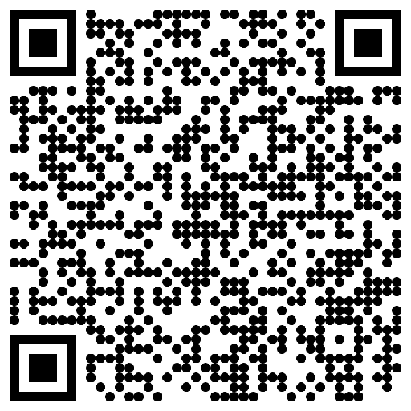
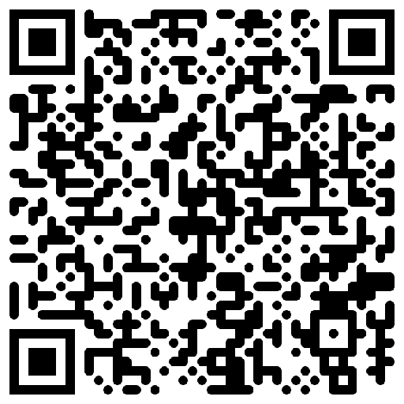
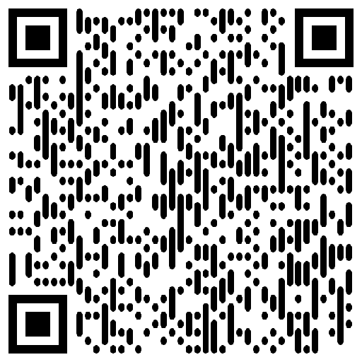
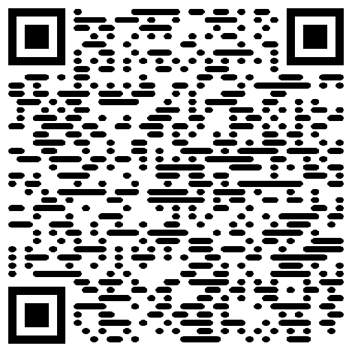

# ComfyQR

A set of ComfyUI nodes to dynamically create QR image layers for generative QR art without the hassle of leaving the webui.

Everything in this pack is primarily focused on the creation of patterns. While the `Mask QR Errors` does some basic statistics on the differences between pixels, a more definative node on determining scannability can be found in the companion project [ComfyQR-scanning-nodes](https://gitlab.com/sofuego-comfy-nodes/ComfyQR-scanning-nodes) which uses additional dependencies for the reading of QRs.

This repository is managed publicly on [Gitlab](https://gitlab.com/sofuego-comfy-nodes/ComfyQR), but also mirrored on [Github](https://github.com/coreyryanhanson/ComfyQR). Please submit any [issues](https://gitlab.com/sofuego-comfy-nodes/ComfyQR/-/issues) or [pull requests](https://gitlab.com/sofuego-comfy-nodes/ComfyQR/-/merge_requests) to the gitlab repo.

## Getting started

This project currently contains two nodes for generating QR codes.

### QR Code and QR Code (Split)

A dynamically sized QR code without any resampling scaled by the text length, the module size, and the error correction level. Use the `QR Code `for simple workflows and the `QR Code (Split)` if you want to build more advanced pipelines with additional outputs for the `MODULE_LAYER`, `FINDER_LAYER`, or `FINDER_MASK`.

#### Inputs

* `protocol` - If enabled this will prefix the textbox input with a preset to represent the internet protocol. This is included both for convenience and as a workaround for the textbox clipping strings with this character combination.
  * `Http` - Adds "http://" before the text.
  * `Https` - Adds "https://" before the text.
  * `None` - Uses only the contents of the `text` box.
* `text` - What text to build your QR code with. If `protocol` is specified, this textbox will be combined it with the selected option.
* `module_size` - The pixel width of the smallest unit of a QR code.
* `max_image_size` - The maximum size of the resulting QR code. If the combination of `text`, `module_size`, and `error_correction` create dimensions that exceed this, an error will halt the pipeline.
* `fill_hexcolor` - A string of characters representing the hex value of the QR units. Can be 3 or 6 hexadecimal characters with an optional # before.
* `back_hexcolor` - A string of characters representing the hex value of the space around the QR units. Can be 3 or 6 hexadecimal characters with an optional # before.
* `error_correction` - The level of error correction to apply.
  * `Low` - 7% error correction.
  * `Medium` - 15% error correction.
  * `Quartile` - 25% error correction.
  * `High` - 30% error correction.
* `border` - The border size (In multiples of `module` widths)
* `module_drawer` - The shape the QR code modules should be. The default is `square`, but see [Alternate Module Drawers](#alternate-module-drawers) below for new examples.

#### Outputs

* `QR_CODE` - The QR code
* `MODULE_LAYER` - The QR code with the `back_hexcolor` filling in the function patterns (to remove their influence from the early diffusion steps).
* `FINDER_LAYER` - The isolated finder patterns over the `back_hexcolor`.
* `FINDER_MASK` - A mask that isolates the locations of the 3 finder patterns.
* `QR_VERSION` - An integer of the QR version that was selected based on the text length and error correction level.
* `IMAGE_SIZE` - An integer based on the pixel width of the resulting QR code.

### QR Code (Conformed to Image Size)

A QR code fixed to specific output dimensions through image resampling.

#### Inputs

* `protocol` - If enabled this will prefix the textbox input with a preset to represent the internet protocol. This is included both for convenience and as a workaround for the textbox clipping strings with this character combination.
  * `Http` - Adds "http://" before the text.
  * `Https` - Adds "https://" before the text.
  * `None` - Uses only the contents of the `text` box.
* `text` - What text to build your QR code with. If `protocol` is specified, this textbox will be combined it with the selected option.
* `image_size` - The pixel dimensions to conform the QR code to.
* `fill_hexcolor` - A string of characters representing the hex value of the QR units. Can be 3 or 6 hexadecimal characters with an optional # before.
* `back_hexcolor` - A string of characters representing the hex value of the space around the QR units. Can be 3 or 6 hexadecimal characters with an optional # before.
* `error_correction` - The level of error correction to apply.
  * `Low` - 7% error correction.
  * `Medium` - 15% error correction.
  * `Quartile` - 25% error correction.
  * `High` - 30% error correction.
* `border` - The border size (In multiples of `module` widths)
* `resampling` - The resampling algorithm to use when rescaling the QR code.
  * `Bicubic` - Bicubic interpolation
  * `Bilinear` - Bilinear interpolation
  * `Box` - Box interpolation
  * `Hamming` - Hamming interpolation
  * `Lanczos` - Lanczos interpolation
  * `Nearest` - Nearest Neighbor interpolation
* `module_drawer` - The shape the QR code modules should be. The default is `square`, but see [Alternate Module Drawers](#alternate-module-drawers) below for new examples.

#### Outputs

* `QR_CODE` - The QR code
* `QR_VERSION` - An integer of the QR version that was selected based on the text length and error correction level.

### Mask QR Errors

A node that that will analyze the differences between a modified QR and create a mask of the estimated errors.

**Note**: _This is an extremly powerful node but relies on several assumptions in order to be used._
1. A QR with a fixed module size that has not been resampled irregularly or distorted.
2. Shared allignment between the `source_qr` and `modified_qr`.
3. Fill and back colors must be perfectly white and black (`#FFFFFF`, `#000000`) for the `source_qr`.
4. The canvas can be bigger than the QR code, but on the `source_qr`, there should be no pixels the same color as the module color outside of the QR exterior.

#### Inputs

* `source_qr` - The original QR code used to generate the image (with the same placement and dimensions as `modified_qr`).
* `modified_qr` - The generated QR art to evaluate (with the same placement and dimensions as `source_qr`).
* `module_size` - The size in pixels of each QR module (the individual blocks that make up a qr code) in the provided images.
* `grayscale_method` - How to convert the RGB color channels to a single grayscale value.
  * `mean` - A simple average of the RGB values.
  * `luminance` - Converts colors to grayscale using a [more advanced formula](https://en.wikipedia.org/wiki/Grayscale#Colorimetric_(perceptual_luminance-preserving)_conversion_to_grayscale) to better match percieved brightness.
* `aggregate_method` - How to aggregate the many pixels that make up a QR module into a single value.
  * `mean` - Within each module a simple average is taken of all constituent pixels.
* `evaluate` - Which part of the QR to examine.
  * `full_qr` - The entire QR code is evaluated.
  * `module_pattern` - Has the node focus only on the modules while excluding the finder pattern.
  * `finder_pattern` - Ignores the modules while examining only the 3 finder patterns at the corners of the QR.
* `error_difficulty` - It is possible that while using the same reader a QR code could be easily scannable on one monitor, but not on another. The way the colors are displayed can have a major effect on unsability. By increasing this threshold, you are simulating inability to distinguish midrange pixels for both the `PERCENT_ERROR` and `QR_ERROR_MASK` outputs. It ranges from 0 to 1 where 0 only automatically fails perfect grays while 1 accepts only exactly matched modules that are perfectly black or white.
* `inverted_pattern` - If set to `True` this assumes that the QR code has inverted colors (a black background with white modules.)
* `gamma` - If using the `grayscale` method based on `luminance`, this will influence the formula by appending the gamma expansion and compression formulas before and after the color conversion. A gamma of 2.2 will use the [formula specific to srgb](qr_nodes.py#0.04045), while other gamma values will simply use the gamma amount as an exponent.

#### Outputs

* `QR_ERROR_MASK` - A mask with white areas falling on locations of modules with errors (precision set by `error_difficulty`). This mask can be used for streamlined img2img operations to salvage unscannable QRs.
* `PERCENT_ERROR` - Number of modules that do not fall into the acceptable threshold (set by `error_difficulty`) divided by the total number of modules.
* `CORRELATION` - The Pearson correlation coefficient between the QR patterns on the `source_qr` and `modified_qr`
* `RMSE` - The root mean squared error between both QR codes. In this case, a value of 0 indicates an identical match to the `source_qr`. A value of 1 indicates a perfect inversion where each expected color is the complete opposite.

## Examples

There is an assortment of workflow examples that can be found in the `examples` directory or in the metadata of the images in the `example_generations` folder. For example taking this image.

And then aggressively increasing the strength of the ControlNet on only the error pixels to make something previously completely unscannable more reliably across different monitors and QR readers.

Any workflow in the example that ends with "validated" (and a few image examples) assume the installation of the [scanning pack](https://gitlab.com/sofuego-comfy-nodes/ComfyQR-scanning-nodes) as well.

## Alternate Module Drawers

The QR generation nodes now support alternate module styles. Experiment using different ones for greater flexibility during generation.

| Square | Gapped Square | Circle | Rounded | Vertical bars | Horizontal bars |
|:---: | :---: | :---: | :---: | :---: | :---: |
|  |  |  |  |  |  |

**Note** _Even unaltered non square styles will inherently register small deviations from RMSE values and possible minute deviations for correlations when using the [Mask QR Errors](#mask-qr-errors) node. When information is extracted, the `source_qr` values are rounded so that they can only be 0 or 1 (to allow alternate drawers to be used as inputs) and matched against the unrounded aggregation of the `modified_qr` values._

## Future updates

If the solution is clean enough and if it can definitively improve scannability, there may be additional plans for the seperation of alignment patterns (based on `module_size`, `border`, and `QR_VERSION`) for more advanced workflows.
